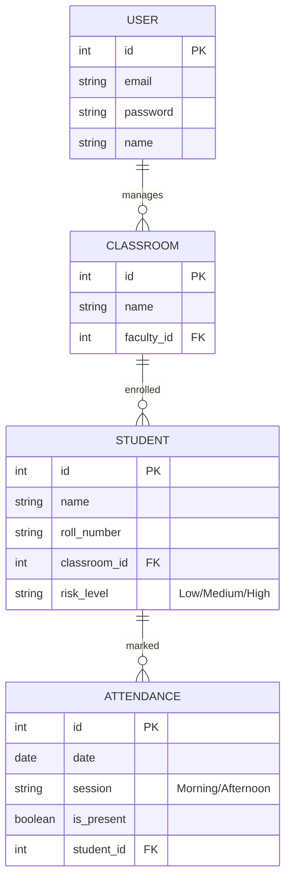

# DB Schema & Entity Design

## ER Diagram

## Table Structures & Data Types

### User Table
| Field | Type | Description | Constraints |
| :--- | :--- | :--- | :--- |
| id | Integer | Unique identifier | Primary Key, Auto-increment |
| email | String(100) | Faculty email | Unique, Not Null |
| password | String(255) | Hashed password | Not Null |
| name | String(1000) | Faculty name | Not Null |

### Classroom Table
| Field | Type | Description | Constraints |
| :--- | :--- | :--- | :--- |
| id | Integer | Unique identifier | Primary Key, Auto-increment |
| name | String(100) | Name of the class | Not Null |
| faculty_id | Integer | Reference to User | Foreign Key, Not Null |

### Student Table
| Field | Type | Description | Constraints |
| :--- | :--- | :--- | :--- |
| id | Integer | Unique identifier | Primary Key, Auto-increment |
| name | String(100) | Student's full name | Not Null |
| roll_number | String(50) | Student's roll number | Not Null |
| classroom_id | Integer | Reference to Classroom | Foreign Key, Not Null |
| risk_level | String(20) | Machine learning risk level | Default 'Low' |

### Attendance Table
| Field | Type | Description | Constraints |
| :--- | :--- | :--- | :--- |
| id | Integer | Unique identifier | Primary Key, Auto-increment |
| date | Date | Date of the session | Not Null |
| session | String(10) | Time of day session | Not Null ('Morning'/'Afternoon') |
| is_present | Boolean | Attendance status | Default False |
| student_id | Integer | Reference to Student | Foreign Key, Not Null |
