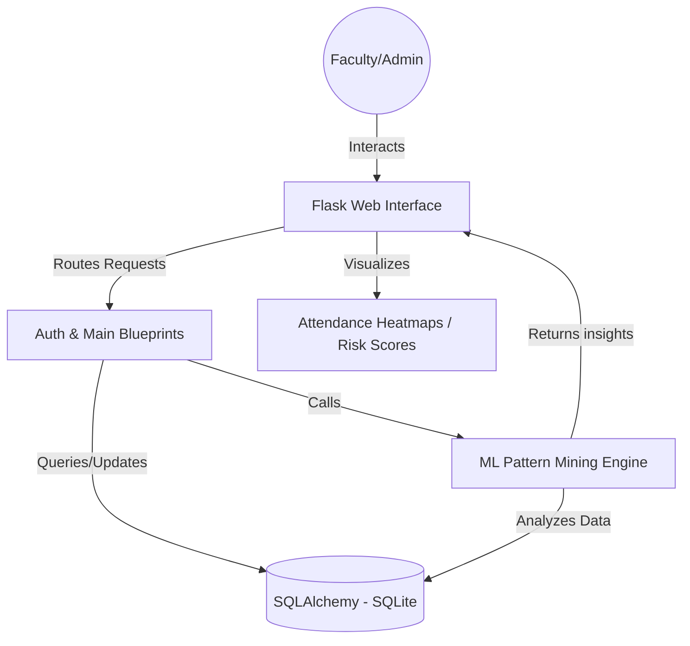

# Technology Stack & Architecture

## Justification of Selected Tech Stack (Flask/ML)

The project currently uses a **Python/Flask** stack with **SQLite** and **SQLAlchemy**. While MERN (MongoDB, Express, React, Node) or PERN (PostgreSQL, Express, React, Node) are popular for general web development, the Flask/ML stack was chosen for this specific Attendance Pattern Mining system for several reasons:

1.  **AI/ML Integration**: Python is the industry standard for Machine Learning. Libraries like `scikit-learn`, `pandas`, and `numpy` (already in `requirements.txt`) are natively supported and highly efficient in a Python ecosystem.
2.  **Lightweight & Fast**: Flask is a micro-framework that allows for rapid development of data-centric applications without the overhead of heavy boilerplate.
3.  **Prototyping & Scalability**: SQLite provides a zero-configuration, self-contained database which is ideal for this application's current scope, while SQLAlchemy allows for an easy migration to more robust databases like PostgreSQL (PERN-like) if needed later.

## System Flow Diagram

Component Interactions:
*   **Web Interface**: Handles HTTP requests, renders Jinja2 templates, and displays attendance data.
*   **Auth Blueprint**: Manages user login/registration and session persistence.
*   **Main Blueprint**: Handles Classroom/Student management and Attendance marking.
*   **ML Engine**: Analyzes attendance history to identify patterns, streaks, and "at-risk" students.
*   **Database (SQLite)**: Stores persistent data for Users, Classrooms, Students, and Attendance records.
